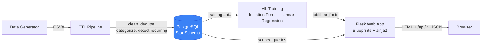
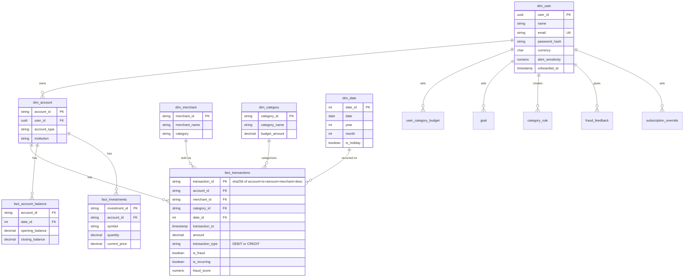

# FinFlow — Personal Finance Intelligence Platform

A personal finance web app for young earners — students on stipends, first-job
professionals, and freelancers with irregular income — built around three
questions:

1. **Where did my money go?**
2. **Is anything wrong?**
3. **Will I be okay next month?**

Every feature in FinFlow exists to answer one of these. It's a full-stack
project: a synthetic data generator, a PostgreSQL star-schema warehouse, an
ETL pipeline, two ML models (fraud detection, cash flow forecasting), and a
Flask web app with server-rendered pages and a JSON API.

## How each question gets answered

| Question | Where |
|---|---|
| Where did my money go? | Dashboard (category breakdown, 6-month trend), Transactions (searchable/filterable ledger with inline category fixes), Reports (plain-language monthly summary, CSV/PDF export) |
| Is anything wrong? | Alerts (unusual-activity flags with plain-language reasons: "9× your median transaction", "new merchant", "3 AM, outside your usual hours"), Budgets (green/amber/red progress) |
| Will I be okay next month? | Forecast (30-day spend prediction with an uncertainty band), Goals (on-track/off-track against your actual savings rate), Subscriptions (recurring-cost audit) |

## Feature list

- Email/password auth (Flask-Login), CSRF on every form, rate-limited login
- Onboarding: upload a bank CSV (with a column-mapping preview) or load realistic demo data for a persona.
  All of your imported statements go into one account; re-uploading a file, or an overlapping one, only adds the rows that are new
- Dashboard: financial health score (0–100, broken into savings rate / budget
  adherence / subscription load / emergency buffer), balance, income vs.
  spending, category doughnut, 6-month trend, latest alerts, subscriptions due
  soon
- Transactions: paginated, searchable, filterable (date/category/account/type/
  amount), inline category editing that can create a standing "always
  categorize X as Y" rule, CSV upload
- Budgets: per-category monthly limits, progress bars, projected month-end spend
- Subscriptions: cadence + amount-stability detection (not "seen 3 times"),
  with "cancel candidate" / "not a subscription" overrides
- Alerts: unusual-activity flags (an anomaly detector, not a fraud verdict) explained in terms of the user's own behavior, with
  "This was me" / "Report as suspicious" feedback capture
- Forecast & What-If: 30-day spend forecast with a prediction interval,
  budget-reduction sliders showing projected 6-month balance impact
- Goals: savings targets with required monthly saving and on/off-track status
  computed from actual trailing savings rate
- Reports: plain-language monthly summary, CSV and PDF export
- Settings: profile, currency, alert sensitivity, category rules, reset demo
  data, delete all data
- Model Info page: what's powering unusual-activity alerts and forecasts, with honest
  metrics — including saying so when a naive baseline beats the ML model
- `/api/v1/*` JSON API, all endpoints authenticated and scoped to the caller's
  own data; `/health` reports DB and model readiness

## Architecture



**Request flow, once running:** the browser talks to Flask blueprints under
`webapp/routes/`; each route scopes every query to `current_user`'s own
accounts (`webapp/db_utils.py:user_account_ids`), loads the persisted model
artifacts from `models/` for fraud/forecast scoring, and returns either a
rendered template or `/api/v1/*` JSON.

## Data warehouse (star schema)



`transaction_id` is a deterministic sha256 hash of (account, timestamp,
amount, merchant, description) rather than a random UUID — re-ingesting the
same CSV twice upserts instead of duplicating (`etl/transform/clean.py:compute_idempotency_key`).

## Project structure

- `data_generator/` — synthetic user/account/transaction generator, three
  personas (student/salaried/freelancer) with income-anchored spend, realistic
  merchants, and a small fixed count of injected fraud per account
- `database/` — `schema.sql` (idempotent: safe to re-run against an existing
  DB), `migrations/` (numbered, idempotent SQL for upgrading an existing
  database) and `migrate.py`, the runner that applies each migration exactly
  once, in order, and records it in a `schema_migrations` table. The seed step
  runs it automatically; run it yourself with `python database/migrate.py`
  (or `--status` to see what's applied/pending). Each migration runs in its own
  transaction, and an advisory lock stops two containers starting together from
  applying the same one twice.
- `etl/` — extract (CSV ingestion), transform (clean/categorize/dedupe/detect
  recurring), load (upsert into Postgres)
- `ml/` — `fraud_model.py` (Isolation Forest, calibrated threshold from
  training-time percentile, not per-batch normalization) and
  `cashflow_model.py` (linear regression, backtested against two naive
  baselines, falls back honestly when it loses)
- `webapp/` — Flask app: `routes/` (one blueprint per concern), `templates/`
  (Jinja2 + Bootstrap 5), `static/`, `forms.py` (Flask-WTF + CSRF), `auth.py`
  (Flask-Login)
- `scripts/` — `seed_demo.py` (idempotent seed script; see below), `stream_data.py` (live data),
  `benchmark_endpoints.py` (times every endpoint for one user with a large history)
- `tests/` — pytest suite, ~90% coverage of `etl/`, `ml/`, `webapp/` (unit tests plus integration tests against real Postgres)
- `.github/workflows/ci.yml` — ruff lint → pytest (coverage-gated, against a real Postgres) → Docker build
  → a smoke job that runs `docker compose up`, waits for `/health`, and logs in as the demo user

## Setup

### Option 1: Docker (recommended)

```bash
docker compose up -d
```

This starts Postgres, runs the **seed step** once (schema + realistic demo
data + trained models — idempotent, skips if data already exists), then
starts the webapp on port 8000. Visit `http://localhost:8000`. A `.dockerignore`
keeps your `.env`, virtualenv, CSVs and trained models out of the image.

> I could not run Docker itself while building this, so the Docker path is
> verified two ways instead: CI's `docker-compose-smoke` job boots the real
> stack on every push, and the same seed → gunicorn → login sequence was run
> by hand against a scratch database. If `docker compose up` misbehaves on your
> machine, that is the first place to look.

**Demo login:** `demo@finflow.app` / `demo1234` (also printed in the seed
container's logs). Every other generated user shares the same password.

> The spec's suggested demo email `demo@finflow.local` doesn't pass this
> app's own email validation — `.local` is a reserved TLD, correctly rejected
> by the `email-validator` library WTForms uses, so nobody could actually log
> in with it through the real form. `demo@finflow.app` is used instead so the
> seeded account is genuinely usable, not just present in the database.

### Option 2: Local setup

```bash
python3 -m venv venv
source venv/bin/activate
pip install -r requirements.txt -r requirements-dev.txt
```

Set up `.env` from `.env.example` (DB credentials + a `SECRET_KEY`) and make
sure Postgres is running (the seed step creates the `finflow` database if it
doesn't exist yet), then:

```bash
python scripts/seed_demo.py          # schema + demo data + trained models, idempotent
export PYTHONPATH=. FLASK_APP=webapp.app
flask run --host 0.0.0.0 --port 5000
```

Or run each step yourself:

```bash
python database/seed_data.py                                  # schema only
python data_generator/generate_mock_data.py --seed 7 --users 9 # sample data
python etl_pipeline.py                                         # load it
python train_models.py                                         # train + evaluate
```

### Tests

```bash
pytest tests/ -q --cov=etl --cov=ml --cov=webapp --cov-report=term-missing
```

Tests marked `integration` (about a third of the suite) run against a real
PostgreSQL server: they create a throwaway `finflow_test_*` database, apply
`database/schema.sql`, and drop it afterwards, so they never touch your real
data. They use the same `DB_*` settings as the app and are skipped
automatically if no server is reachable. CI runs them against a Postgres
service container and requires 80% coverage. To run only the fast,
database-free tests: `pytest -m "not integration"`.

### Live data stream (optional)

Once seeded, `scripts/stream_data.py` can simulate ongoing user activity so
the dashboard keeps changing instead of sitting on a static snapshot. Every
interval it generates a small batch of new, realistic transactions for a
handful of generated/demo accounts (never a user's own imported statement
account), runs them through the same categorization + idempotency-key logic
the CSV-upload path uses, and then makes them behave like any other data:

- today's `fact_account_balance` row for each affected account is updated;
- each new row gets a `fraud_score` (the calibrated 0–1 anomaly probability)
  and `scored_at`. `is_fraud` is deliberately left alone — it's the
  ground-truth label the models are evaluated against;
- `is_recurring` is re-derived from each affected account's *whole* history
  (cadence and amount stability can't be judged from a few fresh rows), and any
  flag that changed — including on older rows — is updated.

It's a standalone script, not part of `docker compose up` — run it yourself,
in a separate terminal, whenever you want to watch the app react to live data:

```bash
python scripts/stream_data.py                             # new batch every 60 min, forever
STREAM_INTERVAL_MINUTES=5 python scripts/stream_data.py   # faster, for a demo
python scripts/stream_data.py --once                       # single batch, then exit
```

## Security notes

- **Session key.** Set `SECRET_KEY` to a private random value
  (`python -c "import secrets; print(secrets.token_hex(32))"`). In production
  (`FLASK_ENV=production`) the app refuses to start without one. In
  development a missing key, or the placeholder from `.env.example`, is replaced
  by a random per-process key with a warning — logins reset on restart, but
  session cookies can never be forged with a publicly known key. Use one
  worker unless `SECRET_KEY` is set, since a random key differs per process.
- **What's covered:** CSRF tokens on every form and API call, hashed passwords,
  login rate limiting, every data route login-protected and scoped to the
  caller's own accounts, output escaping in the UI, same-site-only redirects
  after login, `HttpOnly`/`SameSite` (and `Secure` in production) cookies, and
  `nosniff`/`X-Frame-Options`/`Referrer-Policy` headers.
- **What isn't:** no Content-Security-Policy (the pages use inline scripts and
  CDN assets).
- Internal errors are logged server-side; clients only see generic messages.
- **Rate-limit storage.** Set `REDIS_URL` to share login-rate-limit counters
  across workers/containers via Redis; without it, Flask-Limiter falls back to
  an in-process dict, so each worker counts separately and N workers give N
  times the intended limit (a warning is logged if this happens with
  `FLASK_ENV=production`). `docker-compose.yml` runs a `redis` service and
  sets `REDIS_URL` for the webapp already, though it isn't load-bearing there
  yet since that compose file runs a single gunicorn worker — it becomes
  necessary the moment you add `-w`. See `webapp/extensions.py:load_limiter_storage_uri`
  and `tests/test_rate_limiting.py`, which proves the failure mode
  (two separate app instances, standing in for two workers, do **not** share
  a counter on in-memory storage but **do** share one through Redis) against
  a real `redis://` connection.
- **Automated scanning.** CI's `security` job runs `bandit` (static analysis
  for common Python security issues) against the application code and
  `pip-audit` (known CVEs) against `requirements.txt`, and blocks
  `docker-build`/`docker-compose-smoke` if either fails. Every suppressed
  finding carries an inline `# nosec <rule-id>` comment explaining why it's a
  false positive for this codebase — see `pyproject.toml`'s `[tool.bandit]`
  section for the one repo-wide suppression (`random` used only for synthetic
  demo-data generation, never for tokens/keys/session ids) and
  `etl/load/db.py`/`webapp/routes/transactions.py` for the two places SQL is
  built with an f-string: both validate identifiers or use only fixed literal
  fragments with bound `:params`, and both are covered by tests that attempt
  actual SQL injection against a real database
  (`tests/test_integration_db.py`, `tests/test_integration_routes.py`).

## Performance

`python scripts/benchmark_endpoints.py` seeds one user with a large history in a
throwaway database and times every data endpoint (median of 3 requests, on a
laptop, in-process, so it excludes network):

| Transactions for one user | Slowest endpoint | Typical endpoint |
|---|---|---|
| 50,000 (about a decade of heavy use) | ~0.17 s (dashboard) | 20–100 ms |
| 200,000 | ~0.47 s (dashboard) | 50–370 ms |

It scales roughly linearly and profiling shows the time is mostly fetching rows
(`pd.read_sql` plus the database round trip), not the detection or scoring
logic. So the pandas-based subscription detection was deliberately **not**
rewritten in SQL or cached: it would add a second implementation to keep in
sync, plus cache invalidation, for no visible gain at realistic sizes. A test
(`tests/test_performance.py`) fails if any endpoint exceeds 2 s at 50,000
transactions, which catches order-of-magnitude regressions such as an N+1 query.
If a user ever genuinely reaches the hundreds of thousands, the first step is
to fetch only the columns and time range each endpoint needs.

## Model evaluation (honestly reported)

Numbers below are from the last `train_models.py` run against the seeded
demo dataset (~18.5k transactions, chronological 80/20 split) — also visible
live at `/about-models` for whatever's currently trained.

**Fraud detection (Isolation Forest).** Threshold calibrated at training time
from a percentile of training scores (never per-batch min-max normalization,
which would make the threshold mean something different on every request).

| Metric | Value |
|---|---|
| Precision | 0.60 |
| Recall | 1.00 |
| F1 | 0.75 |
| AUROC | 0.997 |
| Confusion matrix (holdout) | TP=62, FP=42, FN=0, TN=3599 |

Recall of 1.0 with precision of 0.6 is a deliberate posture for this
use case: missing real fraud is worse than a false alarm the user can dismiss
in one tap ("This was me").

**Cash flow forecast (linear regression vs. two naive baselines).**
Rolling-origin backtest over the last 90 days, reporting MAE for the
regression, "same period last month", and "trailing 30-day average":

| Strategy | Backtest MAE |
|---|---|
| Regression (day-of-week + payday + rolling averages) | 471,378 |
| Same period last month | 208,728 |
| Trailing 30-day average | **139,705** (used) |

On the seeded demo data the regression does **not** beat the trailing-average
baseline — the app knows this and uses the baseline instead, which is exactly
what "Will I be okay next month?" should do rather than presenting an
overconfident model. This is a fair result: the demo dataset aggregates many
unrelated personas' spending into one time series (day-to-day totals across
9+ independent households), which is far noisier than one person's own
spending pattern that the model would see in production. A 30-day prediction
interval (from backtest residuals, widening with `√horizon`) is shown either
way, so the forecast never claims false precision.

## Known limitations

- **Aggregate cash flow model.** As above — the regression is evaluated
  against total spend across all demo accounts, not one user's history, which
  understates how well it'd do for a single real user with more days of
  their own data.
- **Global models, per-user inference.** Both models train once on all data
  in the warehouse and score per-user transactions from that shared model,
  by design (matches typical fraud/forecasting setups where you don't have
  enough history per new user to train individually) — but it means a
  newly-onboarded user's alerts reflect population-level patterns until they
  have their own transaction history.
- **Generator income/spend calibration is approximate.** Spend is anchored to
  each persona's income (`target_spend_ratio` in `data_generator/generate_mock_data.py`),
  which keeps totals realistic across a wide range of `--transactions`
  values, but it's still a heuristic, not a calibrated economic model — a
  freelancer persona can occasionally end a year with a negative balance,
  which is intentionally left in as a realistic (not universal) outcome.
- **No PDF/CSV export of the transaction ledger itself** — only the monthly
  report exports (CSV/PDF); a raw transaction export isn't implemented.
- **Balances of imported statements need a balance column or your input.**
  If the CSV has a running-balance column, the opening balance is worked out
  from it (and only trusted if it reconciles with the amounts). Otherwise the
  account starts from ₹0 unless you enter your opening balance at import, so
  the balance shown is the net change since the first imported transaction.
- **UPI payments to people stay in the generic `UPI` category.** The payee is
  parsed out of the narration and matched against known merchants, but a
  person's name can't be told apart from a small shop without more context.
  Recategorize one payment and check "all from this payee" to fix every
  payment to them at once, and future uploads.

## Future work

- OpenAPI/Swagger docs for `/api/v1/*` (see `docs/openapi.json` — a starting
  point, not exhaustively covering every endpoint yet)
- Per-user model fine-tuning once a user has enough of their own history
- Retrain the fraud model on user feedback ("This was me" / "Report as
  suspicious") — the `fraud_feedback` table already captures this, it's just
  not fed back into training yet
